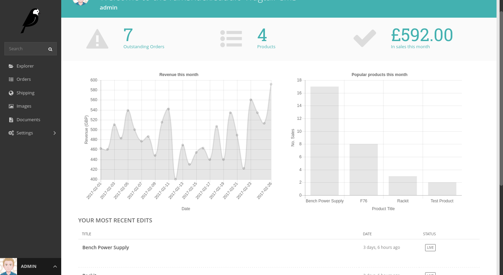

# Longclaw

## Working with Wagtail 4.1

### Temporary developer notes

This is a rework of the Longclaw master branch that adjusts the code for working with Wagtail 2.15+ but makes a few other changes, for now, to hopefully re-boot a Wagtail package that always looked so promising.

I wanted to use this for client work some time back but could not quite get it working but did use a lot of ideas from it in those websites.

## What is fixed

It's opinionated but...

- It requires Wagtail 2.15+ (LTS) and Django 3.2+ (LTS)
- The original tests run OK.
- Tox is modernised and runs in github actions, along with coverage.
- I think I have made the test app work better for a developer.
- Developer setup is improved without been too different.
- The admin site works well, especially nice with Wagtail 4.1
- The orders Dashboard is moved to it's own admin page, at least for the moment.

## What not fixed / removed / broken

Although I haven't included some original code there's no reason It couldn't be added back in.

- Not fixed, frontend client side CSS/JS
- The templates could do with some work.
- The project_template isn't included now.
- The documentation needs attention, mainly to update it to the latest Wagtail version.
- Shopping basket
- Checkout
- And may be something else you see and fancy getting involved in!

## Setup

First create a virtual environment, any how you like and activate it.

```bash
git clone git@github.com:nickmoreton/longclaw.git
git switch modernise-integration
make setup
make countries
make run
```

View <http://localhost:8000> the test app home page

View <http://localhost:8000/admin> the wagtail admin. User: `test` Password: `test`

See the Makefile for some more developer commands.

Once logged in add a Product Index page and some products

---


## Call For Maintainers
If you are interested in developing this project, please get in touch
https://github.com/JamesRamm/longclaw/issues/375

[](https://badge.fury.io/py/longclaw)
[](https://codecov.io/gh/JamesRamm/longclaw)
[](https://travis-ci.org/JamesRamm/longclaw)
[](https://landscape.io/github/JamesRamm/longclaw/master)

An e-commerce extension for [Wagtail CMS](https://github.com/wagtail/wagtail)


Checkout the [documentation](https://jamesramm.github.io/longclaw/)



## Quickstart

Install Longclaw:

```bash
  $ pip install longclaw
```

Setup a Longclaw project

```bash
  $ longclaw start my_project
```

Go to project directory and create missing migrations 

```bash
  $ python manage.py makemigrations home catalog
```

Do migrations for whole project and run 

```bash
  $ python manage.py migrate
  $ python manage.py loadcountries
  $ python manage.py createsuperuser
  $ python manage.py runserver
```

## Features

- Tightly integrated with Wagtail. Create products, manage orders, configure shipping and view statistics all from the Wagtail admin.
- Multiple payment backends. Longclaw currently supports Stripe, Braintree and PayPal (v.zero) payments.
- Comprehensive REST API & javascript client easily loaded via a template tag
- Create your catalogue as Wagtail pages, with complete control over your product fields
- Easy setup. Just run `longclaw start my_project` to get going
- Simple to use, simple to change. Write your frontend as you would any other wagtail website. No complicated overriding, forking etc in order to customise behaviour.


### Screenshots


