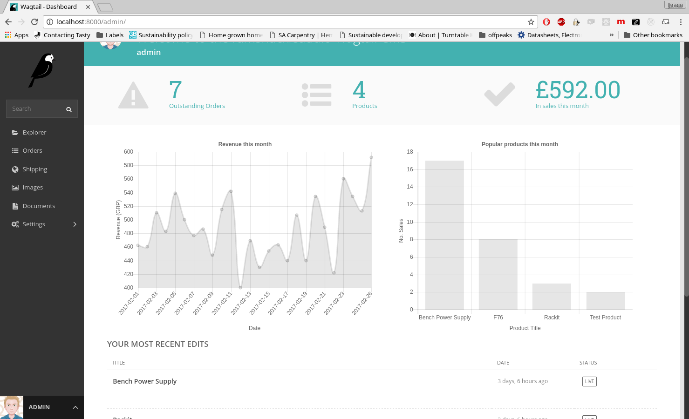
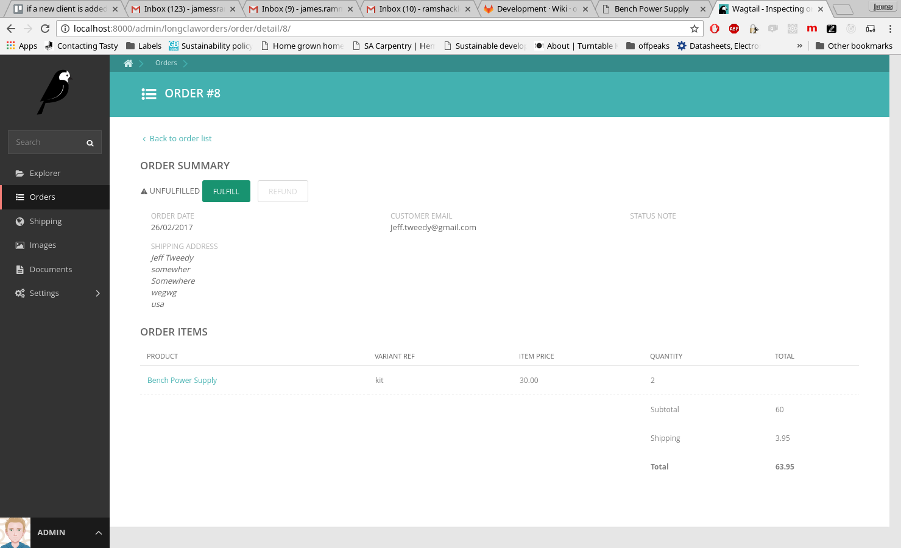

# Longclaw


[](https://badge.fury.io/py/longclaw)
[](https://codecov.io/gh/JamesRamm/longclaw)
[](https://travis-ci.org/JamesRamm/longclaw)
[](https://landscape.io/github/JamesRamm/longclaw/master)

An e-commerce extension for [Wagtail CMS](https://github.com/wagtail/wagtail)

>Longclaw is currently undergoing a major rewrite to bring it up to date with wagtail/django 2 and pack in more features

Checkout the [demo site](https://github.com/JamesRamm/longclaw_demo) and [documentation](http://longclaw.readthedocs.io/en/latest/)

<a href="https://www.buymeacoffee.com/pHtXDM748" target="_blank"></a>



## Quickstart

Install Longclaw:

```bash
  $ pip install longclaw
```

Setup a Longclaw project

```bash
  $ longclaw start my_project
```

## Features

- Tightly integrated with Wagtail. Create products, manage orders, configure shipping and view statistics all from the Wagtail admin.
- Multiple payment backends. Longclaw currently supports Stripe, Braintree and PayPal (v.zero) payments.
- Comprehensive REST API & javascript client easily loaded via a template tag
- Create your catalogue as Wagtail pages, with complete control over your product fields
- Easy setup. Just run `longclaw start my_project` to get going
- Simple to use, simple to change. Write your frontend as you would any other wagtail website. No complicated overriding, forking etc in order to customise behaviour.


### Screenshots




## Support


Please raise bugs/feature requests using the github issue tracker and ask questions on stackoverflow.
For further support contact ramshacklerecording@gmail.com


