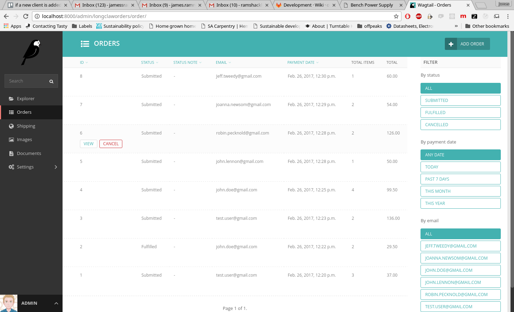

=============================
Longclaw
=============================

.. image:: https://badge.fury.io/py/longclaw.svg
    :target: https://badge.fury.io/py/longclaw

.. image:: https://codecov.io/gh/JamesRamm/longclaw/branch/master/graph/badge.svg
  :target: https://codecov.io/gh/JamesRamm/longclaw

.. image:: https://travis-ci.org/JamesRamm/longclaw.svg?branch=master
    :target: https://travis-ci.org/JamesRamm/longclaw

.. image:: https://landscape.io/github/JamesRamm/longclaw/master/landscape.svg?style=flat
   :target: https://landscape.io/github/JamesRamm/longclaw/master
   :alt: Code Health

.. image:: https://readthedocs.org/projects/longclaw/badge/?version=latest
    :target: http://longclaw.readthedocs.io/en/latest/?badge=latest
    :alt: Documentation Status

An e-commerce extension for `Wagtail CMS <https://github.com/wagtail/wagtail>`_
Checkout the `demo site <https://github.com/JamesRamm/longclaw_demo>`_ and `documentation <http://longclaw.readthedocs.io/en/latest/>`_

.. image:: docs/_static/images/dashboard.png
    :alt: Longclaw dashboard

Quickstart
----------
Install Longclaw::

  $ pip install longclaw

Setup a Wagtail+Longclaw project::

  $ longclaw start my_project

Features
--------

View and fulfill orders from the Wagtail admin
+++++++++++++++++++++++++++++++++++++++++++++++

The orders list can be sorted and filtered by status, date or customer

.. image:: docs/_static/images/order_detail.png

Variable Shipping Rates
+++++++++++++++++++++++

Manage your shipping destinations and rates from the Wagtail admin.

Pluggable basket and checkout API
++++++++++++++++++++++++++++++++++

Longclaw provides a simple RESTful API for retrieving/updating the shopping basket and for performing a checkout.
Longclaw currently supports Stripe, Braintree and PayPal (v.zero) payments.

Easy project startup and catalogue modelling
++++++++++++++++++++++++++++++++++++++++++++

Longclaw provides a project template to easily setup your Wagtail + Longclaw project. This sets up a basic ``ProductVariant`` model
so you can get started adding your product-specific fields straight away.

Test Coverage
--------------

.. image:: https://codecov.io/gh/JamesRamm/longclaw/branch/master/graphs/tree.svg

Support
--------

Please raise bugs/feature requests using the github issue tracker and ask questions on stackoverflow.

